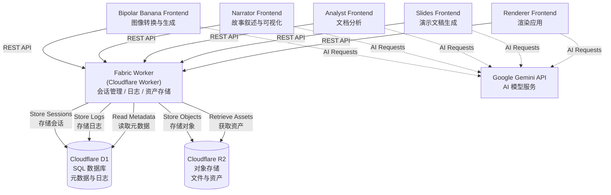

# Fabric - AI-Powered Multi-Application Ecosystem

## Table of Contents / 目录

- [Overview / 概述](#overview--概述)
- [Architecture / 架构](#architecture--架构)
- [Frontend Applications / 前端应用](#frontend-applications--前端应用)
- [Technology Stack / 技术栈](#technology-stack--技术栈)
- [Getting Started / 快速开始](#getting-started--快速开始)
- [Worker Backend Setup / Worker 后端设置](#worker-backend-setup--worker-后端设置)
- [Frontend Setup / 前端设置](#frontend-setup--前端设置)
- [API Reference / API 接口文档](#api-reference--api-接口文档)
- [Database Schema / 数据库结构](#database-schema--数据库结构)
- [Integration Guide / 集成指南](#integration-guide--集成指南)
- [Development Workflow / 开发流程](#development-workflow--开发流程)
- [Troubleshooting / 故障排除](#troubleshooting--故障排除)

## Overview / 概述

Fabric is a comprehensive multi-application ecosystem built around a shared Cloudflare Worker backend. It provides a unified infrastructure for AI-powered creative tools, enabling session management, structured logging, and asset storage across multiple frontend applications.

Fabric 是一个围绕共享 Cloudflare Worker 后端构建的综合性多应用生态系统。它为 AI 驱动的创意工具提供统一的基础设施，支持跨多个前端应用的会话管理、结构化日志记录和资产存储。

**Key Features / 主要特性:**
- **Centralized Backend / 集中式后端**: Single Cloudflare Worker serves all frontend applications / 单个 Cloudflare Worker 服务所有前端应用
- **Session Management / 会话管理**: Unique session IDs for tracking user interactions / 使用唯一会话 ID 跟踪用户交互
- **Structured Logging / 结构化日志**: Comprehensive logging system with levels, messages, and context / 具有级别、消息和上下文的综合日志系统
- **Asset Storage / 资产存储**: Automated ZIP extraction and storage in Cloudflare R2 / 自动 ZIP 提取并存储到 Cloudflare R2
- **Token-Based Security / 基于令牌的安全**: Bearer token authentication for all API endpoints / 所有 API 端点使用 Bearer 令牌认证
- **Persistent App Storage / 持久应用存储**: Sessionless storage for long-term app artifacts / 用于长期应用工件的无会话存储

## Architecture / 架构

### System Architecture / 系统架构



### Data Flow / 数据流

1. **Session Creation / 会话创建**: Frontend creates a session with app name and metadata / 前端使用应用名称和元数据创建会话
2. **AI Processing / AI 处理**: Frontend calls Gemini API for AI-powered features / 前端调用 Gemini API 实现 AI 功能
3. **Log Streaming / 日志流**: During execution, logs are streamed to Worker backend / 执行期间，日志流式传输到 Worker 后端
4. **Asset Upload / 资产上传**: Generated files (images, audio, documents) are zipped and uploaded / 生成的文件（图像、音频、文档）被压缩并上传
5. **Storage / 存储**: Worker extracts ZIP, stores files in R2, and records metadata in D1 / Worker 解压 ZIP，将文件存储到 R2，并在 D1 中记录元数据
6. **Retrieval / 检索**: Frontend can query session data, logs, and download assets / 前端可以查询会话数据、日志并下载资产

## Frontend Applications / 前端应用

### Bipolar Banana / 双极香蕉
**Multi-mode Image Transformation and Generation Tool / 多模式图像转换与生成工具**

A sophisticated image processing application with 8 operational modes:
- **ONE_IMAGE**: Transform single image into manic/depressive artistic versions
- **TWO_IMAGES**: Analyze and intelligently fuse two images
- **BIPOLAR_GENERATION**: Generate bipolar artwork from single image
- **DECORATION**: Floor plan analysis and AI-driven room decoration
- **REFINEMENT**: Advanced image style transformation
- **SMART_STYLE**: AI-driven style selection with temperature control
- **P5_ANIMATION**: Generate p5.js animations from images
- **DECOUPLING**: Image decoupling and separation workflows

功能强大的图像处理应用，包含 8 种操作模式：单图像转换、双图像融合、双极生成、装饰设计、风格精修、智能风格选择、P5 动画生成、图像解耦。

**Tech Stack**: React 19 + Vite + Gemini API (`@google/genai`) + Tailwind CSS
**技术栈**: React 19 + Vite + Gemini API + Tailwind CSS

### Narrator / 叙述者
**Interactive Story Narration with 3D Visualization / 交互式故事叙述与 3D 可视化**

Creates immersive narrative experiences with Three.js-powered 3D visualization.

使用 Three.js 驱动的 3D 可视化创建沉浸式叙事体验。

**Tech Stack**: React 19 + Vite + Gemini API + Three.js
**技术栈**: React 19 + Vite + Gemini API + Three.js

### Analyst / 分析师
**Document Analysis and Insights Generation / 文档分析与洞察生成**

Powered by Gemini AI for comprehensive document analysis and insight extraction.

由 Gemini AI 驱动，用于全面的文档分析和洞察提取。

**Tech Stack**: React + Vite + Gemini API
**技术栈**: React + Vite + Gemini API

### Slides / 幻灯片
**AI-Powered Presentation Generation / AI 驱动的演示文稿生成**

Automatically generates presentation slides from content input.

从内容输入自动生成演示文稿幻灯片。

**Tech Stack**: React + Vite + Gemini API
**技术栈**: React + Vite + Gemini API

### Renderer / 渲染器
**Advanced Rendering Application / 高级渲染应用**

Specialized rendering capabilities for various media types.

针对各种媒体类型的专业渲染功能。

**Tech Stack**: React + Vite + Gemini API
**技术栈**: React + Vite + Gemini API

## Technology Stack / 技术栈

### Backend / 后端
- **Cloudflare Workers**: Serverless edge computing platform / 无服务器边缘计算平台
- **Cloudflare D1**: Serverless SQL database for metadata and logs / 用于元数据和日志的无服务器 SQL 数据库
- **Cloudflare R2**: Object storage for assets (S3-compatible) / 资产对象存储（S3 兼容）
- **itty-router**: Lightweight routing for Cloudflare Workers / Cloudflare Workers 的轻量级路由
- **@zip.js/zip.js**: ZIP file handling and extraction / ZIP 文件处理和解压
- **nanoid**: Unique ID generation / 唯一 ID 生成
- **zod**: TypeScript-first schema validation / TypeScript 优先的模式验证

### Frontend / 前端
- **React 19**: Modern UI library / 现代 UI 库
- **TypeScript 5.8**: Type-safe JavaScript / 类型安全的 JavaScript
- **Vite 6**: Fast build tool and dev server / 快速构建工具和开发服务器
- **Tailwind CSS**: Utility-first CSS framework / 实用优先的 CSS 框架
- **@google/genai**: Google Gemini API SDK / Google Gemini API SDK
- **JSZip**: ZIP file creation in browser / 浏览器中的 ZIP 文件创建

### AI Models / AI 模型
- **gemini-2.5-flash**: Fast image analysis / 快速图像分析
- **gemini-2.5-pro**: Complex generation tasks / 复杂生成任务
- **gemini-2.5-flash-image**: Image generation and editing / 图像生成与编辑

## Getting Started / 快速开始

### Prerequisites / 前置要求

1. **Node.js**: Version 18 or higher / 版本 18 或更高
2. **npm**: Comes with Node.js / 随 Node.js 一起安装
3. **Cloudflare Account**: For Worker, D1, and R2 / 用于 Worker、D1 和 R2
4. **Wrangler CLI**: Cloudflare's CLI tool / Cloudflare 的命令行工具
   ```bash
   npm install -g wrangler
   ```
5. **Google Gemini API Key**: For AI features / 用于 AI 功能
   - Get from: https://aistudio.google.com/app/apikey
   - 从此处获取: https://aistudio.google.com/app/apikey

### Quick Start / 快速启动

```bash
# Clone the repository / 克隆仓库
git clone <repository-url>
cd fabric

# Install Worker dependencies / 安装 Worker 依赖
cd worker
npm install

# Install frontend dependencies (example: Bipolar Banana) / 安装前端依赖（示例：双极香蕉）
cd ../bipolar_banana
npm install
```

## Worker Backend Setup / Worker 后端设置

### 1. Create Cloudflare Resources / 创建 Cloudflare 资源

#### Create D1 Database / 创建 D1 数据库
```bash
wrangler d1 create fabric_db
```

This will output a database ID. Copy it for the next step.
这将输出一个数据库 ID。复制它以便下一步使用。

**Example output / 示例输出:**
```
✅ Successfully created DB 'fabric_db' in region APAC
Created your database using D1's new storage backend.

[[d1_databases]]
binding = "FABRIC_DB"
database_name = "fabric_db"
database_id = "xxxxxxxx-xxxx-xxxx-xxxx-xxxxxxxxxxxx"
```

#### Create R2 Bucket / 创建 R2 存储桶
```bash
wrangler r2 bucket create fabric-assets
```

### 2. Configure wrangler.toml / 配置 wrangler.toml

Update `worker/wrangler.toml` with your database ID and bucket name:
使用您的数据库 ID 和存储桶名称更新 `worker/wrangler.toml`：

```toml
name = "fabric-worker"
main = "src/index.ts"
compatibility_date = "2024-10-01"

[[d1_databases]]
binding = "FABRIC_DB"
database_name = "fabric_db"
database_id = "<your-database-id>"  # Replace with your actual database ID / 替换为实际的数据库 ID
migrations_dir = "./migrations"

[[r2_buckets]]
binding = "FABRIC_ASSETS"
bucket_name = "fabric-assets"
```

### 3. Run Database Migrations / 运行数据库迁移

#### Local Development / 本地开发
```bash
cd worker
wrangler d1 migrations apply fabric_db --local
```

#### Production / 生产环境
```bash
wrangler d1 migrations apply fabric_db --remote
```

### 4. Set Secrets / 设置密钥

#### Required: Authentication Token / 必需：认证令牌
```bash
wrangler secret put FABRIC_TOKEN
# Enter a secure random token when prompted / 提示时输入安全的随机令牌
# Example: Use `openssl rand -base64 32` to generate / 示例：使用 `openssl rand -base64 32` 生成
```

#### Optional: Upload Size Limit / 可选：上传大小限制
```bash
wrangler secret put FABRIC_MAX_UPLOAD_MB
# Default is 100 MB if not set / 如果不设置，默认为 100 MB
```

### 5. Local Development / 本地开发

```bash
cd worker
npm run dev
```

The Worker will be available at `http://localhost:8787`
Worker 将在 `http://localhost:8787` 上运行

**Test health endpoint / 测试健康检查端点:**
```bash
curl http://localhost:8787/health
# Should return: {"status":"ok","timestamp":"2024-..."}
# 应返回: {"status":"ok","timestamp":"2024-..."}
```

### 6. Deploy to Production / 部署到生产环境

```bash
cd worker
npm run deploy
```

After deployment, your Worker will be available at:
部署后，Worker 将在以下地址可用：
```
https://<your-worker-name>.workers.dev
```

**Verify deployment / 验证部署:**
```bash
curl https://<your-worker-name>.workers.dev/health
```

## Frontend Setup / 前端设置

### General Setup for All Frontends / 所有前端的通用设置

Each frontend application follows the same setup pattern:
每个前端应用都遵循相同的设置模式：

### 1. Install Dependencies / 安装依赖

```bash
cd <frontend-directory>  # bipolar_banana, narrator, analyst, slides, or renderer
npm install
```

### 2. Configure Environment / 配置环境

Create a `.env.local` file in the frontend directory:
在前端目录中创建 `.env.local` 文件：

```bash
# Required: Google Gemini API Key / 必需：Google Gemini API 密钥
GEMINI_API_KEY=your_gemini_api_key_here

# Optional: For Cloudflare download mode / 可选：用于 Cloudflare 下载模式
FABRIC_BASE_URL=https://<your-worker>.workers.dev
FABRIC_TOKEN=<same-token-as-worker>
```

### 3. Run Development Server / 运行开发服务器

```bash
npm run dev
```

The application will typically run on `http://localhost:3000`
应用通常会在 `http://localhost:3000` 上运行

### 4. Build for Production / 生产构建

```bash
npm run build
```

Output will be in the `dist/` directory.
输出将在 `dist/` 目录中。

### 5. Preview Production Build / 预览生产构建

```bash
npm run preview
```

## API Reference / API 接口文档

### Authentication / 认证

All API endpoints (except `/health`) require Bearer token authentication:
所有 API 端点（除 `/health` 外）都需要 Bearer 令牌认证：

```http
Authorization: Bearer <your-fabric-token>
```

### Endpoints / 端点列表

#### Health Check / 健康检查

```http
GET /health
```

**Response / 响应:**
```json
{
  "status": "ok",
  "timestamp": "2024-11-07T10:00:00.000Z"
}
```

---

### Session Management / 会话管理

#### Create Session / 创建会话

```http
POST /sessions
Content-Type: application/json
Authorization: Bearer <token>

{
  "appName": "Bipolar Banana",
  "metadata": {
    "runId": "uuid-here",
    "userInput": "Transform image to manic style"
  }
}
```

**Response / 响应:**
```json
{
  "sessionId": "a2B3c4D5e6F7g8H9j0K1"
}
```

**Status Codes / 状态码:**
- `201`: Session created successfully / 会话创建成功
- `400`: Invalid payload / 无效的载荷
- `401`: Unauthorized / 未授权

#### List Sessions / 列出会话

```http
GET /sessions?appName=<name|all>
Authorization: Bearer <token>
```

**Query Parameters / 查询参数:**
- `appName`: Filter by app name, or "all" for all sessions / 按应用名称过滤，或使用 "all" 获取所有会话

**Response / 响应:**
```json
{
  "sessions": [
    {
      "sessionId": "a2B3c4D5e6F7g8H9j0K1",
      "appName": "Bipolar Banana",
      "status": "active",
      "metadata": {...},
      "createdAt": "2024-11-07T10:00:00.000Z",
      "updatedAt": "2024-11-07T10:05:00.000Z"
    }
  ]
}
```

#### Get Session Details / 获取会话详情

```http
GET /sessions/:sessionId
Authorization: Bearer <token>
```

**Response / 响应:**
```json
{
  "session": {
    "sessionId": "a2B3c4D5e6F7g8H9j0K1",
    "appName": "Bipolar Banana",
    "status": "active",
    "metadata": {...},
    "createdAt": "2024-11-07T10:00:00.000Z",
    "updatedAt": "2024-11-07T10:05:00.000Z"
  },
  "logCount": 42,
  "assetCount": 5
}
```

---

### Logging / 日志记录

#### Append Logs / 追加日志

```http
POST /sessions/:sessionId/logs
Content-Type: application/json
Authorization: Bearer <token>

{
  "entries": [
    {
      "level": "info",
      "message": "Started image processing",
      "context": { "imageCount": 2 }
    },
    {
      "level": "warn",
      "message": "Low quality image detected",
      "context": { "filename": "input.jpg" }
    }
  ]
}
```

**Log Levels / 日志级别:**
- `debug`: Detailed debugging information / 详细调试信息
- `info`: General informational messages / 一般信息消息
- `warn`: Warning messages / 警告消息
- `error`: Error messages / 错误消息

**Response / 响应:**
```json
{
  "inserted": 2
}
```

#### Get Session Logs / 获取会话日志

```http
GET /sessions/:sessionId/logs
Authorization: Bearer <token>
```

**Response / 响应:**
```json
{
  "logs": [
    {
      "sequence": 1,
      "level": "info",
      "message": "Started image processing",
      "context": { "imageCount": 2 },
      "createdAt": "2024-11-07T10:00:00.000Z"
    }
  ]
}
```

---

### Asset Management / 资产管理

#### Upload Assets / 上传资产

```http
POST /sessions/:sessionId/assets
Content-Type: application/zip
Authorization: Bearer <token>

<ZIP file binary data>
```

**Notes / 注意事项:**
- Upload a ZIP file containing all generated assets / 上传包含所有生成资产的 ZIP 文件
- Files are automatically extracted and stored in R2 / 文件会自动解压并存储到 R2
- File paths in ZIP are sanitized for security / ZIP 中的文件路径会被清理以确保安全
- Maximum size controlled by `FABRIC_MAX_UPLOAD_MB` / 最大大小由 `FABRIC_MAX_UPLOAD_MB` 控制

**Response / 响应:**
```json
{
  "uploaded": 5,
  "files": [
    "manic_output.png",
    "depressive_output.png",
    "analysis.json",
    "log.txt",
    "metadata.json"
  ]
}
```

**Status Codes / 状态码:**
- `200`: Assets uploaded successfully / 资产上传成功
- `413`: Payload too large / 载荷过大
- `500`: Storage error / 存储错误

#### List Session Assets / 列出会话资产

```http
GET /sessions/:sessionId/assets
Authorization: Bearer <token>
```

**Response / 响应:**
```json
{
  "assets": [
    {
      "filename": "manic_output.png",
      "contentType": "image/png",
      "size": 245678,
      "checksum": "sha256-...",
      "url": "https://<worker>.workers.dev/sessions/<id>/assets/manic_output.png",
      "createdAt": "2024-11-07T10:05:00.000Z"
    }
  ]
}
```

#### Download Single Asset / 下载单个资产

```http
GET /sessions/:sessionId/assets/:assetName
Authorization: Bearer <token>
```

Returns the file with appropriate `Content-Type` header.
返回带有适当 `Content-Type` 头的文件。

#### Download All Assets as ZIP / 下载所有资产为 ZIP

```http
GET /sessions/:sessionId/assets/archive
Authorization: Bearer <token>
```

Returns a ZIP file containing all session assets.
返回包含所有会话资产的 ZIP 文件。

---

### App Storage (Sessionless) / 应用存储（无会话）

#### Get App Logs / 获取应用日志

```http
GET /apps/:appName/storage/logs?limit=50&cursor=2024-11-07T10:00:00.000Z
Authorization: Bearer <token>
```

**Query Parameters / 查询参数:**
- `limit`: Number of logs to return (1-100, default 20) / 返回的日志数量（1-100，默认 20）
- `cursor`: ISO timestamp for pagination / 用于分页的 ISO 时间戳

**Response / 响应:**
```json
{
  "logs": [
    {
      "id": "abc123def456...",
      "appName": "Bipolar Banana",
      "level": "info",
      "message": "App started",
      "metadata": {...},
      "createdAt": "2024-11-07T10:00:00.000Z",
      "updatedAt": "2024-11-07T10:00:00.000Z"
    }
  ],
  "nextCursor": "2024-11-07T09:00:00.000Z"
}
```

#### Create App Log / 创建应用日志

```http
POST /apps/:appName/storage/logs
Content-Type: application/json
Authorization: Bearer <token>

{
  "level": "info",
  "message": "Download bundle ready",
  "metadata": {
    "artifactName": "run-2024-11-07.zip",
    "size": 1048576
  }
}
```

#### Update App Log / 更新应用日志

```http
PUT /apps/:appName/storage/logs/:logId
Content-Type: application/json
Authorization: Bearer <token>

{
  "level": "error",
  "message": "Download failed",
  "metadata": {...}
}
```

#### Delete App Log / 删除应用日志

```http
DELETE /apps/:appName/storage/logs/:logId
Authorization: Bearer <token>
```

#### Upload App Objects / 上传应用对象

```http
POST /apps/:appName/storage/objects
Content-Type: application/zip
Authorization: Bearer <token>

<ZIP file binary data>
```

Uploads and unpacks files into app-specific R2 storage.
上传并解压文件到应用专用的 R2 存储。

#### List App Objects / 列出应用对象

```http
GET /apps/:appName/storage/objects
Authorization: Bearer <token>
```

**Response / 响应:**
```json
{
  "objects": [
    {
      "filename": "prompt-library.json",
      "contentType": "application/json",
      "size": 4096,
      "checksum": "sha256-...",
      "url": "https://<worker>.workers.dev/apps/<app>/storage/objects/prompt-library.json",
      "metadata": {...},
      "createdAt": "2024-11-07T10:00:00.000Z",
      "updatedAt": "2024-11-07T10:00:00.000Z"
    }
  ]
}
```

#### Download All App Objects as ZIP / 下载所有应用对象为 ZIP

```http
GET /apps/:appName/storage/objects/archive
Authorization: Bearer <token>
```

Perfect for "download everything" functionality in local mode.
非常适合本地模式下的"下载所有内容"功能。

#### Download Single App Object / 下载单个应用对象

```http
GET /apps/:appName/storage/objects/:objectName
Authorization: Bearer <token>
```

#### Delete App Object / 删除应用对象

```http
DELETE /apps/:appName/storage/objects/:objectName
Authorization: Bearer <token>
```

## Database Schema / 数据库结构

### sessions Table / 会话表

Stores session metadata and status.
存储会话元数据和状态。

```sql
CREATE TABLE sessions (
  id TEXT PRIMARY KEY,              -- Unique session ID (20 chars) / 唯一会话 ID（20 字符）
  app_name TEXT NOT NULL,           -- Application name / 应用名称
  token_id TEXT NOT NULL,           -- Hashed token for auth / 用于认证的哈希令牌
  status TEXT NOT NULL DEFAULT 'active',  -- Session status / 会话状态
  metadata TEXT,                    -- JSON metadata / JSON 元数据
  created_at TEXT NOT NULL,         -- Creation timestamp / 创建时间戳
  updated_at TEXT NOT NULL          -- Last update timestamp / 最后更新时间戳
);
```

### logs Table / 日志表

Stores structured log entries for each session.
存储每个会话的结构化日志条目。

```sql
CREATE TABLE logs (
  id INTEGER PRIMARY KEY AUTOINCREMENT,
  session_id TEXT NOT NULL REFERENCES sessions(id) ON DELETE CASCADE,
  sequence INTEGER NOT NULL,        -- Log sequence number / 日志序列号
  level TEXT NOT NULL,              -- Log level (debug/info/warn/error) / 日志级别
  message TEXT NOT NULL,            -- Log message / 日志消息
  context TEXT,                     -- JSON context data / JSON 上下文数据
  created_at TEXT NOT NULL,
  UNIQUE(session_id, sequence)      -- Ensure sequence uniqueness / 确保序列唯一性
);
```

### assets Table / 资产表

Stores metadata for uploaded assets.
存储上传资产的元数据。

```sql
CREATE TABLE assets (
  id INTEGER PRIMARY KEY AUTOINCREMENT,
  session_id TEXT NOT NULL REFERENCES sessions(id) ON DELETE CASCADE,
  object_key TEXT NOT NULL,         -- R2 object key / R2 对象键
  filename TEXT NOT NULL,           -- Original filename / 原始文件名
  content_type TEXT,                -- MIME type / MIME 类型
  size INTEGER NOT NULL,            -- File size in bytes / 文件大小（字节）
  checksum TEXT,                    -- SHA-256 checksum / SHA-256 校验和
  created_at TEXT NOT NULL,
  UNIQUE(session_id, filename)      -- One asset per filename per session / 每个会话每个文件名一个资产
);
```

### app_storage_logs Table / 应用存储日志表

Stores persistent logs for apps (sessionless).
存储应用的持久日志（无会话）。

```sql
CREATE TABLE app_storage_logs (
  id TEXT PRIMARY KEY,              -- Unique log ID (24 chars) / 唯一日志 ID（24 字符）
  app_name TEXT NOT NULL,           -- Application name / 应用名称
  level TEXT NOT NULL DEFAULT 'info',
  message TEXT NOT NULL,
  metadata TEXT,                    -- JSON metadata / JSON 元数据
  created_at TEXT NOT NULL,
  updated_at TEXT NOT NULL
);

CREATE INDEX idx_app_storage_logs_app ON app_storage_logs (app_name, created_at DESC);
```

### app_storage_objects Table / 应用存储对象表

Stores metadata for app-level persistent objects.
存储应用级持久对象的元数据。

```sql
CREATE TABLE app_storage_objects (
  id INTEGER PRIMARY KEY AUTOINCREMENT,
  app_name TEXT NOT NULL,
  object_key TEXT NOT NULL,         -- R2 object key / R2 对象键
  filename TEXT NOT NULL,
  content_type TEXT,
  size INTEGER NOT NULL,
  checksum TEXT,
  metadata TEXT,                    -- JSON metadata / JSON 元数据
  created_at TEXT NOT NULL,
  updated_at TEXT NOT NULL,
  UNIQUE(app_name, filename)        -- One object per filename per app / 每个应用每个文件名一个对象
);

CREATE INDEX idx_app_storage_objects_app ON app_storage_objects (app_name, filename);
```

## Integration Guide / 集成指南

### Frontend Integration Pattern / 前端集成模式

#### Step 1: Create Fabric Adapter / 创建 Fabric 适配器

Create `services/fabricAdapter.ts` in your frontend:
在前端中创建 `services/fabricAdapter.ts`：

```typescript
// Fabric Worker Integration
// Fabric Worker 集成

interface LogEntry {
  level?: string;
  message: string;
  context?: any;
}

export async function createSession(
  baseUrl: string,
  token: string,
  metadata: any
): Promise<string> {
  const response = await fetch(`${baseUrl}/sessions`, {
    method: 'POST',
    headers: {
      'Authorization': `Bearer ${token}`,
      'Content-Type': 'application/json',
    },
    body: JSON.stringify({
      appName: 'Your App Name',
      metadata,
    }),
  });

  if (!response.ok) {
    throw new Error(`Failed to create session: ${response.statusText}`);
  }

  const data = await response.json();
  return data.sessionId;
}

export async function appendLogs(
  baseUrl: string,
  token: string,
  sessionId: string,
  logs: LogEntry[]
): Promise<void> {
  const response = await fetch(`${baseUrl}/sessions/${sessionId}/logs`, {
    method: 'POST',
    headers: {
      'Authorization': `Bearer ${token}`,
      'Content-Type': 'application/json',
    },
    body: JSON.stringify({ entries: logs }),
  });

  if (!response.ok) {
    throw new Error(`Failed to append logs: ${response.statusText}`);
  }
}

export async function uploadAssets(
  baseUrl: string,
  token: string,
  sessionId: string,
  zipBlob: Blob
): Promise<void> {
  const response = await fetch(`${baseUrl}/sessions/${sessionId}/assets`, {
    method: 'POST',
    headers: {
      'Authorization': `Bearer ${token}`,
      'Content-Type': 'application/zip',
    },
    body: zipBlob,
  });

  if (!response.ok) {
    throw new Error(`Failed to upload assets: ${response.statusText}`);
  }
}
```

#### Step 2: Integrate in Your Workflow / 在工作流中集成

```typescript
import JSZip from 'jszip';
import * as fabricAdapter from './services/fabricAdapter';

async function runWorkflow() {
  const baseUrl = import.meta.env.FABRIC_BASE_URL;
  const token = import.meta.env.FABRIC_TOKEN;

  // 1. Create session / 创建会话
  const sessionId = await fabricAdapter.createSession(baseUrl, token, {
    runId: crypto.randomUUID(),
    userInput: 'Example workflow',
  });

  // 2. Stream logs during execution / 执行期间流式传输日志
  await fabricAdapter.appendLogs(baseUrl, token, sessionId, [
    { level: 'info', message: 'Workflow started' },
  ]);

  // 3. Do your AI processing... / 进行 AI 处理...
  const generatedImage = await generateImage();

  await fabricAdapter.appendLogs(baseUrl, token, sessionId, [
    { level: 'info', message: 'Image generated successfully' },
  ]);

  // 4. Package assets into ZIP / 将资产打包为 ZIP
  const zip = new JSZip();
  zip.file('output.png', generatedImage);
  zip.file('metadata.json', JSON.stringify({ sessionId }));

  const zipBlob = await zip.generateAsync({ type: 'blob' });

  // 5. Upload to Worker / 上传到 Worker
  await fabricAdapter.uploadAssets(baseUrl, token, sessionId, zipBlob);

  await fabricAdapter.appendLogs(baseUrl, token, sessionId, [
    { level: 'info', message: 'Assets uploaded successfully' },
  ]);
}
```

### Download Modes / 下载模式

#### Local Mode / 本地模式

Generate ZIP in browser and trigger download directly:
在浏览器中生成 ZIP 并直接触发下载：

```typescript
const zip = new JSZip();
// Add all generated files / 添加所有生成的文件
zip.file('image1.png', imageBlob1);
zip.file('image2.png', imageBlob2);
zip.file('log.txt', logText);

const zipBlob = await zip.generateAsync({ type: 'blob' });

// Trigger download / 触发下载
const url = URL.createObjectURL(zipBlob);
const a = document.createElement('a');
a.href = url;
a.download = `output-${Date.now()}.zip`;
a.click();
URL.revokeObjectURL(url);
```

#### Cloudflare Mode / Cloudflare 模式

Upload to Worker, then download from Worker:
上传到 Worker，然后从 Worker 下载：

```typescript
// Upload / 上传
await fabricAdapter.uploadAssets(baseUrl, token, sessionId, zipBlob);

// Download / 下载
const downloadUrl = `${baseUrl}/sessions/${sessionId}/assets/archive`;
window.open(downloadUrl + `?token=${token}`, '_blank');
```

## Development Workflow / 开发流程

### 1. Local Development / 本地开发

```bash
# Terminal 1: Run Worker locally / 终端 1：本地运行 Worker
cd worker
npm run dev  # Runs on http://localhost:8787

# Terminal 2: Run frontend / 终端 2：运行前端
cd bipolar_banana  # or any other frontend / 或任何其他前端
npm run dev  # Runs on http://localhost:3000
```

**Configure frontend to use local Worker / 配置前端使用本地 Worker:**
```bash
# .env.local
FABRIC_BASE_URL=http://localhost:8787
FABRIC_TOKEN=your-test-token
```

### 2. Testing / 测试

#### Test Worker Endpoints / 测试 Worker 端点

```bash
# Health check / 健康检查
curl http://localhost:8787/health

# Create session / 创建会话
curl -X POST http://localhost:8787/sessions \
  -H "Authorization: Bearer your-test-token" \
  -H "Content-Type: application/json" \
  -d '{"appName":"TestApp","metadata":{"test":true}}'
```

#### Test App Storage / 测试应用存储

```bash
cd worker
npm run test:app-storage
```

### 3. Database Inspection / 数据库检查

#### Local Database / 本地数据库

```bash
# Query local D1 database / 查询本地 D1 数据库
wrangler d1 execute fabric_db --local --command "SELECT * FROM sessions LIMIT 10"
```

#### Remote Database / 远程数据库

```bash
# Query production database / 查询生产数据库
wrangler d1 execute fabric_db --remote --command "SELECT COUNT(*) FROM sessions"
```

### 4. Adding New Migrations / 添加新迁移

```bash
# Create new migration file / 创建新迁移文件
cd worker/migrations
touch 0003_add_new_feature.sql

# Write your SQL / 编写 SQL
echo "ALTER TABLE sessions ADD COLUMN new_field TEXT;" > 0003_add_new_feature.sql

# Apply migration / 应用迁移
wrangler d1 migrations apply fabric_db --local   # Test locally / 本地测试
wrangler d1 migrations apply fabric_db --remote  # Deploy to prod / 部署到生产
```

### 5. Monitoring / 监控

```bash
# View Worker logs / 查看 Worker 日志
wrangler tail

# View specific deployment / 查看特定部署
wrangler tail --format pretty
```

## Troubleshooting / 故障排除

### Common Issues / 常见问题

#### 1. 401 Unauthorized / 未授权

**Problem / 问题:** API requests return 401 status.
API 请求返回 401 状态。

**Solution / 解决方案:**
- Verify `FABRIC_TOKEN` matches between Worker and frontend / 验证 Worker 和前端之间的 `FABRIC_TOKEN` 匹配
- Check Authorization header format: `Bearer <token>` / 检查授权头格式：`Bearer <token>`
- Ensure token is set in Worker: `wrangler secret list` / 确保 Worker 中已设置令牌：`wrangler secret list`

```bash
# Re-set token / 重新设置令牌
wrangler secret put FABRIC_TOKEN
```

#### 2. 413 Payload Too Large / 载荷过大

**Problem / 问题:** Asset upload fails with 413 error.
资产上传失败，返回 413 错误。

**Solution / 解决方案:**
- Increase upload limit / 增加上传限制:
```bash
wrangler secret put FABRIC_MAX_UPLOAD_MB
# Enter value like: 200
```
- Compress images before adding to ZIP / 在添加到 ZIP 之前压缩图像
- Upload assets in multiple batches / 分批上传资产

#### 3. D1 Database Not Found / 找不到 D1 数据库

**Problem / 问题:** Worker can't connect to D1.
Worker 无法连接到 D1。

**Solution / 解决方案:**
- Verify `database_id` in `wrangler.toml` matches your database / 验证 `wrangler.toml` 中的 `database_id` 与您的数据库匹配
- Check database exists: `wrangler d1 list` / 检查数据库是否存在：`wrangler d1 list`
- Ensure migrations are applied / 确保已应用迁移

#### 4. R2 Bucket Access Denied / R2 存储桶访问被拒绝

**Problem / 问题:** Asset storage fails.
资产存储失败。

**Solution / 解决方案:**
- Verify bucket name in `wrangler.toml` / 验证 `wrangler.toml` 中的存储桶名称
- Check bucket exists: `wrangler r2 bucket list` / 检查存储桶是否存在：`wrangler r2 bucket list`
- Ensure bucket binding name is `FABRIC_ASSETS` / 确保存储桶绑定名称为 `FABRIC_ASSETS`

#### 5. CORS Errors in Browser / 浏览器中的 CORS 错误

**Problem / 问题:** Frontend can't make requests due to CORS.
前端因 CORS 而无法发出请求。

**Solution / 解决方案:**
- CORS headers are already configured in Worker / Worker 中已配置 CORS 头
- Ensure you're using correct HTTP method / 确保使用正确的 HTTP 方法
- Check browser console for specific CORS error / 检查浏览器控制台以获取具体的 CORS 错误

#### 6. Gemini API Errors / Gemini API 错误

**Problem / 问题:** AI features not working.
AI 功能无法正常工作。

**Solution / 解决方案:**
- Verify `GEMINI_API_KEY` in `.env.local` / 验证 `.env.local` 中的 `GEMINI_API_KEY`
- Check API key is valid at https://aistudio.google.com / 在 https://aistudio.google.com 检查 API 密钥是否有效
- Monitor API quotas and rate limits / 监控 API 配额和速率限制
- Check model names are correct (e.g., `gemini-2.5-flash`) / 检查模型名称是否正确（例如 `gemini-2.5-flash`）

#### 7. ZIP Extraction Fails / ZIP 解压失败

**Problem / 问题:** Uploaded ZIP files are not extracted properly.
上传的 ZIP 文件未正确解压。

**Solution / 解决方案:**
- Ensure ZIP file is valid / 确保 ZIP 文件有效
- Check file paths don't contain `..` or absolute paths / 检查文件路径不包含 `..` 或绝对路径
- Verify `Content-Type: application/zip` header / 验证 `Content-Type: application/zip` 头
- Check Worker logs for specific error messages / 检查 Worker 日志以获取具体错误消息

### Debug Mode / 调试模式

Enable detailed logging in Worker by checking logs:
通过检查日志在 Worker 中启用详细日志记录：

```bash
# Local / 本地
npm run dev  # Logs appear in terminal / 日志显示在终端中

# Production / 生产环境
wrangler tail --format pretty
```

### Getting Help / 获取帮助

1. Check `worker/ADAPTER_GUIDE.md` for integration details / 查看 `worker/ADAPTER_GUIDE.md` 获取集成详情
2. Review Worker logs for error messages / 查看 Worker 日志以获取错误消息
3. Inspect D1 database to verify data / 检查 D1 数据库以验证数据
4. Test endpoints with curl to isolate issues / 使用 curl 测试端点以隔离问题

## Security Best Practices / 安全最佳实践

1. **Never commit secrets / 永不提交密钥**
   - Keep `.env.local` out of version control / 将 `.env.local` 排除在版本控制之外
   - Use `wrangler secret` for Worker tokens / 对 Worker 令牌使用 `wrangler secret`

2. **Rotate tokens regularly / 定期轮换令牌**
   ```bash
   wrangler secret put FABRIC_TOKEN
   ```

3. **Validate file uploads / 验证文件上传**
   - Worker automatically sanitizes file paths / Worker 自动清理文件路径
   - Enforce upload size limits / 强制执行上传大小限制

4. **Use HTTPS in production / 在生产环境中使用 HTTPS**
   - Always use `https://` for Worker URL / 始终对 Worker URL 使用 `https://`
   - Enable CORS only for trusted origins if needed / 如需要，仅对受信任的来源启用 CORS

5. **Monitor usage / 监控使用情况**
   - Track D1 database size / 跟踪 D1 数据库大小
   - Monitor R2 storage costs / 监控 R2 存储成本
   - Set up alerts for unusual activity / 为异常活动设置警报

## Contributing / 贡献

For questions or contributions, please refer to the integration guide at `worker/ADAPTER_GUIDE.md`.
如有问题或贡献，请参阅 `worker/ADAPTER_GUIDE.md` 中的集成指南。

## License / 许可证

[Your License Here]
[此处填写您的许可证]

---

**Built with Cloudflare Workers, D1, R2, and Google Gemini API**
**使用 Cloudflare Workers、D1、R2 和 Google Gemini API 构建**
