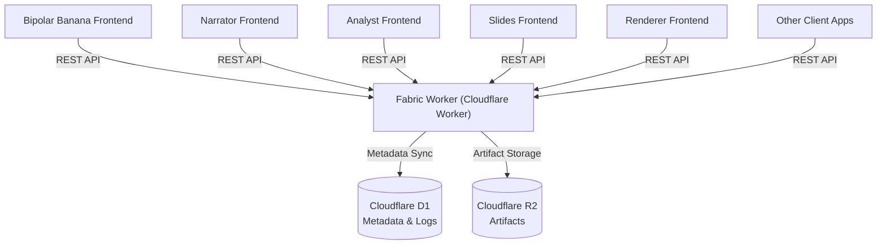

# Fabric Worker Backend

## Overview / 概述
Fabric Worker is the shared Cloudflare Worker backend that powers the Bipolar Banana, Narrator, Analyst, Slides, and Renderer frontends alongside other AI-driven tools. It issues session IDs, stores metadata and logs in Cloudflare D1, archives run artifacts in Cloudflare R2, and exposes a token-protected REST API for every client.  
Fabric Worker 是 Bipolar Banana、Narrator、Analyst、Slides、Renderer 等前端应用与其他 AI 工具的共享 Cloudflare Worker 后端，负责生成会话 ID，将元数据与日志写入 Cloudflare D1，把运行产物归档到 Cloudflare R2，并通过令牌保护的 REST API 为所有客户端提供服务。

## Architecture / 架构

Clients call the Worker REST API; the Worker persists structured logs and metadata to D1 and streams archives into R2 for later retrieval.  
客户端通过 REST API 调用 Worker；Worker 将结构化日志和元数据保存到 D1，并把归档文件写入 R2 以便之后检索。

## Deployment / 部署

### 1. Prepare Cloudflare resources / 准备 Cloudflare 资源
- Create a D1 database: `wrangler d1 create fabric_db` (replace the name as needed).  
  创建 D1 数据库：`wrangler d1 create fabric_db`（名称可自定义）。
- Create an R2 bucket: `wrangler r2 bucket create fabric-assets`.  
  创建 R2 存储桶：`wrangler r2 bucket create fabric-assets`。
- Update `worker/wrangler.toml` with the generated `database_id`, bucket binding, and desired deployment name.  
  将生成的 `database_id`、存储桶绑定和部署名称写入 `worker/wrangler.toml`。

### 2. Configure environment / 配置环境
- Install dependencies from `worker/`: `npm install`.  
  在 `worker/` 目录安装依赖：`npm install`。
- Apply initial D1 migrations locally and remotely:  
  ```bash
  wrangler d1 migrations apply fabric_db --local
  wrangler d1 migrations apply fabric_db --remote
  ```  
  在本地与远端执行初始 D1 迁移。
- Set required secrets (token and optional limits):  
  ```bash
  wrangler secret put FABRIC_TOKEN
  # Optional: wrangler secret put FABRIC_MAX_UPLOAD_MB
  ```  
  设置必要的密钥（令牌及可选的上传限制）。
- For each frontend (e.g., Bipolar Banana, Narrator, Analyst, Slides, Renderer), point to the Worker by updating its `.env.local`:  
  ```bash
  FABRIC_BASE_URL=https://<your-worker>.workers.dev
  FABRIC_TOKEN=<same-token-as-above>
  ```  
  为每个前端（如 Bipolar Banana、Narrator、Analyst、Slides、Renderer）在 `.env.local` 中配置 Worker 地址与令牌。

### 3. Deploy and verify / 部署与验证
- Start local development if needed: `npm run dev` (uses Wrangler to emulate bindings).  
  如需本地调试：`npm run dev`（Wrangler 会模拟绑定）。
- Publish to Cloudflare: `npm run deploy`.  
  发布到 Cloudflare：`npm run deploy`。
- Confirm the health endpoint responds with `{ "status": "ok" }` and test a full run from the Bipolar Banana, Narrator, Analyst, Slides, and Renderer frontends.  
  验证健康检查返回 `{ "status": "ok" }` 并分别从 Bipolar Banana、Narrator、Analyst、Slides、Renderer 前端完成一次完整运行测试。

## Next Steps / 后续步骤
- Add more client adapters by following `worker/ADAPTER_GUIDE.md`.  
  按照 `worker/ADAPTER_GUIDE.md` 添加更多客户端适配器。
- Monitor D1/R2 usage and rotate API tokens periodically.  
  监控 D1/R2 使用情况并定期轮换 API 令牌。

## API Reference / 接口速查
- `GET /health` — worker liveness.  
  `GET /health` — 返回 Worker 健康状态。
- `POST /sessions` — create a session with optional metadata.  
  `POST /sessions` — 创建会话，可附带元数据。
- `GET /sessions?appName=<name|all>` — list sessions with metadata and timestamps.  
  `GET /sessions?appName=<name|all>` — 返回会话详情列表（含元数据与时间戳）。
- `GET /sessions/:sessionId/assets` — list stored assets for a session.  
  `GET /sessions/:sessionId/assets` — 查看指定会话的资产列表。
- `GET /sessions/:sessionId/assets/archive` — download a zip of all assets for a session.  
  `GET /sessions/:sessionId/assets/archive` — 将指定会话的所有资产打包下载。
- `GET /apps/:appName/storage/logs?limit=<1-100>&cursor=<ISO>` — list app-managed log entries (sessionless).  
  `GET /apps/:appName/storage/logs?limit=<1-100>&cursor=<ISO>` — 列出某个应用的持久日志。  
- `POST /apps/:appName/storage/logs` — insert a log entry; `PUT /apps/:appName/storage/logs/:logId` updates it; `DELETE /apps/:appName/storage/logs/:logId` removes it.  
  `POST /apps/:appName/storage/logs` — 新增日志；`PUT /apps/:appName/storage/logs/:logId` 更新；`DELETE ...` 删除。  
- `POST /apps/:appName/storage/objects` — upload a ZIP archive to unpack into app-specific R2 objects (no session required).  
  `POST /apps/:appName/storage/objects` — 上传 ZIP 自动解压到应用私有 R2 空间。  
- `GET /apps/:appName/storage/objects` — list stored objects with download URLs.  
  `GET /apps/:appName/storage/objects` — 查看应用资产列表并获取下载链接。  
- `GET /apps/:appName/storage/objects/archive` — download all app objects as a zip;  
  `GET /apps/:appName/storage/objects/archive` — 将应用资产整体打包下载。  
- `GET /apps/:appName/storage/objects/:objectName` & `DELETE /apps/:appName/storage/objects/:objectName` — fetch or remove a single stored object.  
  `GET /apps/:appName/storage/objects/:objectName` 与 `DELETE ...` — 获取或删除单个资产。
